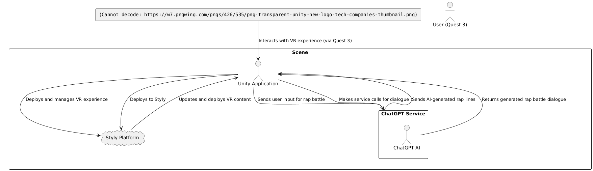

# RealityHack_RapBattleVR
AI-Powered VR battle rap game where you rise from the underground scene to face rap legends.

VR battle rap game fueled by AI where you move up the ranks from the underground rap scene to battling legends of the game.

## Architecture

To provide a cutting edge experience we use a modern architecture that leverages AI and VR device compatibility. We Use Styly to support both the Meta Quest and Apple Vision Pro devices.

rectangle '' as unity
actor User as 'User (Quest 3)'
rectangle 'Unity Client' {
    'Unity Application' --> 'ChatGPT Service' : Sends user input for rap battle
    'Unity Application' --> 'Styly Platform' : Deploys and manages VR experience
}
rectangle 'ChatGPT Service' {
    'ChatGPT AI' --> 'Unity Application' : Returns generated rap battle dialogue
}
cloud 'Styly Platform' {
    'Styly Platform' --> 'Unity Application' : Updates and deploys VR content
}
' Show data flow between components
unity -down-> 'Unity Application' : Interacts with VR experience (via Quest 3)
'Unity Application' -down-> 'ChatGPT Service' : Makes service calls for dialogue
'ChatGPT Service' -down-> 'Unity Application' : Sends AI-generated rap lines
'Unity Application' -down-> 'Styly Platform' : Deploys to Styly
@enduml
">

## Technologies

